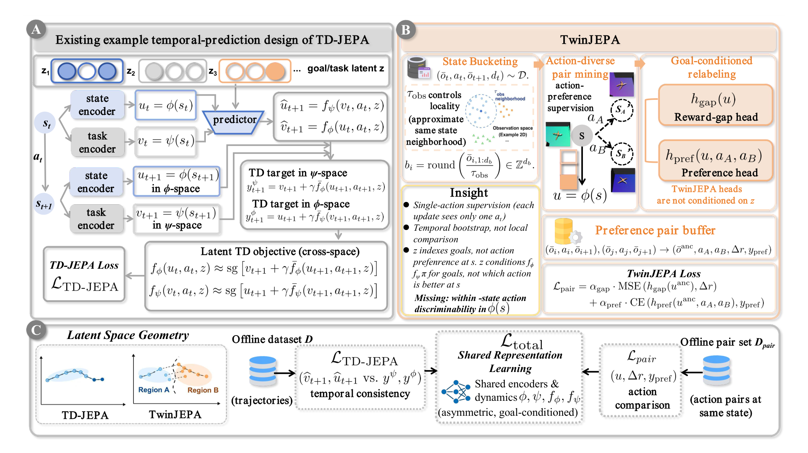
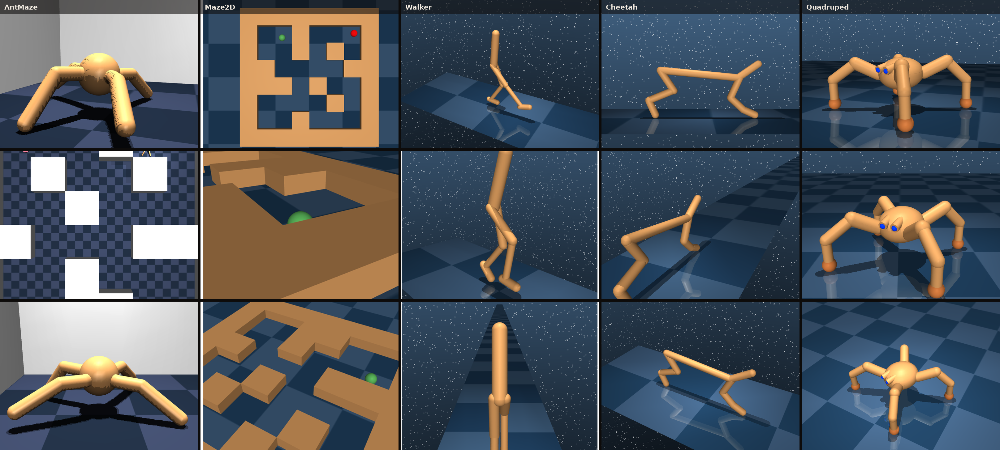
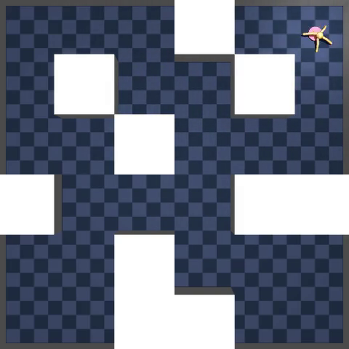
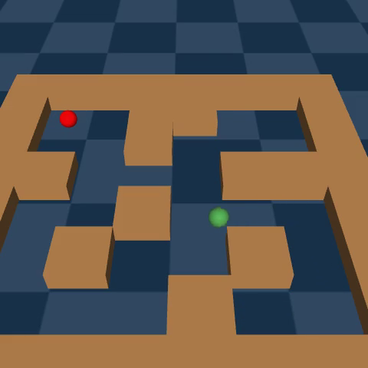
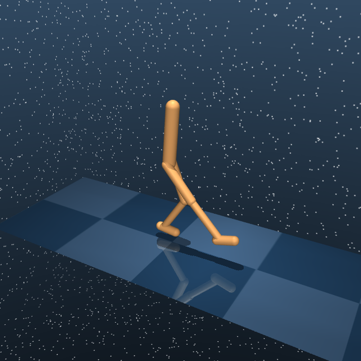
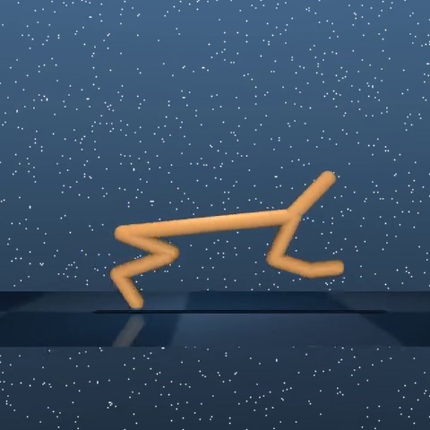
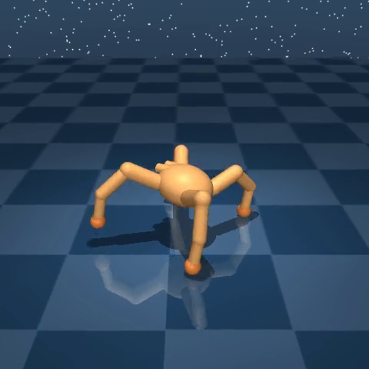

<h1 align="center">TwinJEPA</h1>

  <em>Action-Preferred Predictive Representations for Goal-Conditioned Control</em>

  <strong>Feiran You</strong> &nbsp;·&nbsp; <strong>Hongyang Du</strong> 
  The University of Hong Kong

  <a href="https://feiranyou.github.io/twinjepa/"><strong>Project page</strong></a>
  &nbsp;&nbsp;·&nbsp;&nbsp;
  <a href="https://arxiv.org/abs/2610.02922"><strong>Paper</strong></a>

  TwinJEPA enhances joint-embedding predictive architectures with action-preference learning for offline zero-shot control.

  

  <strong>Figure 1.</strong>
  A temporal-prediction objective learns goal-conditioned structure.
  TwinJEPA mines action-diverse pairs and trains reward-gap and preference heads on one shared representation.

<h2 align="center">Environments</h2>

  

<table>
  <tr>
    <td align="center" width="20%"></td>
    <td align="center" width="20%"></td>
    <td align="center" width="20%"></td>
    <td align="center" width="20%"></td>
    <td align="center" width="20%"></td>
  </tr>
  <tr>
    <td align="center"><strong>AntMaze</strong> OGBench</td>
    <td align="center"><strong>Maze2D</strong> D4RL</td>
    <td align="center"><strong>Walker</strong> DMC</td>
    <td align="center"><strong>Cheetah</strong> ExORL</td>
    <td align="center"><strong>Quadruped</strong> ExORL</td>
  </tr>
</table>

<h2 align="center">Demos</h2>

  Failure on the left, success on the right. Press play here, then open the project page for the matched figures and write-up. 
  <a href="https://feiranyou.github.io/twinjepa/#demos"><strong>Watch every demo on the project page</strong></a>

<h3 align="center">ExORL Quadruped · stand</h3>
<table>
  <tr>
    <td align="center" width="50%"><video src="https://github.com/user-attachments/assets/34423392-5052-4665-a13e-da7dcdf554f2" controls muted playsinline width="100%"></video></td>
    <td align="center" width="50%"><video src="https://github.com/user-attachments/assets/85837382-e934-4c5b-be83-2cd804553e2f" controls muted playsinline width="100%"></video></td>
  </tr>
  <tr>
    <td align="center"><strong>Low return</strong> collapsed / unstable</td>
    <td align="center"><strong>High return</strong> upright torso</td>
  </tr>
</table>

<h3 align="center">ExORL Cheetah · run</h3>
<table>
  <tr>
    <td align="center" width="50%"><video src="https://github.com/user-attachments/assets/e50b2b10-a91b-4e66-948c-4d5b36698b33" controls muted playsinline width="100%"></video></td>
    <td align="center" width="50%"><video src="https://github.com/user-attachments/assets/8ebf98b8-23c5-4cbd-a63a-dcd9d91273ec" controls muted playsinline width="100%"></video></td>
  </tr>
  <tr>
    <td align="center"><strong>Low return</strong> little forward progress</td>
    <td align="center"><strong>High return</strong> forward locomotion</td>
  </tr>
</table>

<h3 align="center">DMC Walker · walk</h3>
<table>
  <tr>
    <td align="center" width="50%"><video src="https://github.com/user-attachments/assets/76d3a460-d8b7-4857-90e9-6d88fb246fda" controls muted playsinline width="100%"></video></td>
    <td align="center" width="50%"><video src="https://github.com/user-attachments/assets/2529efd0-4921-4d7a-8fb9-7be6746c2637" controls muted playsinline width="100%"></video></td>
  </tr>
  <tr>
    <td align="center"><strong>Low return</strong> from the offline buffer</td>
    <td align="center"><strong>High return</strong> upright forward gait</td>
  </tr>
</table>

<h3 align="center">D4RL Maze2D · task 1</h3>
<table>
  <tr>
    <td align="center" width="50%"><video src="https://github.com/user-attachments/assets/dece16cb-3c8c-4238-bc8e-24129719d0a5" controls muted playsinline width="100%"></video></td>
    <td align="center" width="50%"><video src="https://github.com/user-attachments/assets/5db3e1c1-a8a6-4d6d-bbea-fd708da54a89" controls muted playsinline width="100%"></video></td>
  </tr>
  <tr>
    <td align="center"><strong>Miss</strong> stays far from the goal</td>
    <td align="center"><strong>Hit</strong> enters the goal cell</td>
  </tr>
</table>

<h3 align="center">OGBench AntMaze · task 1</h3>
<table>
  <tr>
    <td align="center" width="50%"><video src="https://github.com/user-attachments/assets/7db0c5d3-fe6c-4ee1-bf24-1d622f5060ed" controls muted playsinline width="100%"></video></td>
    <td align="center" width="50%"><video src="https://github.com/user-attachments/assets/04458f53-6044-4f4b-ae71-c9bbdff72764" controls muted playsinline width="100%"></video></td>
  </tr>
  <tr>
    <td align="center"><strong>Miss</strong> never reaches the goal</td>
    <td align="center"><strong>Hit</strong> reaches the goal</td>
  </tr>
</table>

  <a href="https://feiranyou.github.io/twinjepa/"><strong>Project page</strong></a>
  &nbsp;&nbsp;·&nbsp;&nbsp;
  <a href="https://arxiv.org/abs/2610.02922"><strong>Paper</strong></a>

